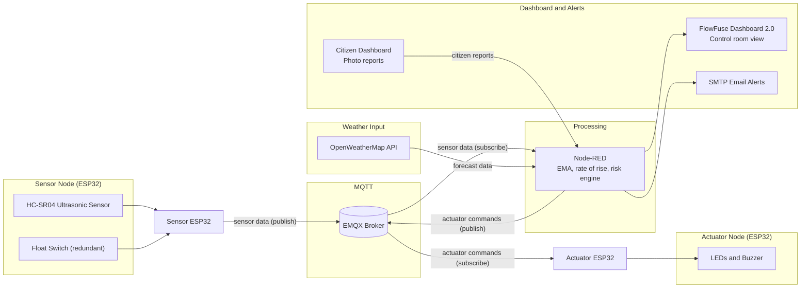

# Intelligent Water Clogging and Flood Prevention Using Real-Time Data

**Smart Drain Monitoring System: Flood and Road Hazard Early Warning for Urban Drains (Bengaluru PoC)**

An IoT-based real-time drain monitoring and flood early-warning system that combines water-level sensing, weather forecasts, risk analysis, automated alerts and a live dashboard.

Built as a capstone project for the **Samsung Innovation Campus (IoT)** program at **RNS Institute of Technology, Bengaluru**, September 2026.

> This is a proof of concept built with a bucket as a small-scale drain model. It has not been deployed in any municipal drainage network.

---

## Demo Videos

Videos are hosted on Google Drive because of GitHub file size limits.

**[Watch the demo videos (Google Drive folder)](https://drive.google.com/drive/folders/1869mVIRYLwwES12wQjYP1Cnl_X0ko-AE?usp=sharing)**

| Video | Description |
|-------|-------------|
| 01-dashboard-overview | Walkthrough of the live control-room dashboard. |
| 02-project-demo-no-voiceover-subtitles | Full working demo with subtitles and no voiceover. |
| 03-final-presentation-to-instructor | Final presentation and explanation given on 17 September 2026. |

---

## Table of Contents

- [Overview](#overview)
- [Key Features](#key-features)
- [System Architecture](#system-architecture)
- [How It Works](#how-it-works)
- [Risk Classification and Decision Logic](#risk-classification-and-decision-logic)
- [Alert and Acknowledgement Workflow](#alert-and-acknowledgement-workflow)
- [Technology Stack](#technology-stack)
- [MQTT Communication](#mqtt-communication)
- [Dashboard and Screenshots](#dashboard-and-screenshots)
- [Project Structure](#project-structure)
- [Installation and Setup](#installation-and-setup)
- [Testing and Demonstration](#testing-and-demonstration)
- [Limitations](#limitations)
- [Future Enhancements](#future-enhancements)
- [Team and Mentor](#team-and-mentor)
- [License](#license)

---

## Overview

### Problem

Bengaluru can experience waterlogging within minutes of heavy rain. Storm-water drains overflow or get blocked, roads flood, and authorities often learn about the situation only after flooding has begun. There is no real-time visibility of drain conditions.

### Solution

The system monitors drain water level continuously, calculates how fast the level is rising, combines this with weather forecast data, and classifies flood risk. It then notifies the control room through a live dashboard and email alerts, and drives on-site indicators (LEDs and a buzzer) through a second ESP32 node.

A bucket is used as a small-scale model of a drain for the prototype.

---

## Key Features

- Real-time water-level monitoring with an ultrasonic sensor
- Exponential Moving Average (EMA) smoothing of sensor readings
- Rate-of-rise calculation, not just a fixed level threshold
- Weather-aware risk assessment using OpenWeatherMap forecast data
- Redundant sensing with a float switch
- Four risk states: Normal, Watch, Alert, Critical
- Automatic escalation of an unacknowledged Alert to Critical after 60 seconds
- Email notifications for Alert and Critical states
- Live control-room dashboard built with FlowFuse Dashboard 2.0
- Sensor and actuator node status monitoring
- Citizen reporting dashboard with photo uploads
- On-site LED indicators and buzzer driven by a separate actuator node

---

## System Architecture



**Data flows**

| Flow | Path |
|------|------|
| Sensor data | Sensor ESP32 to EMQX broker to Node-RED |
| Weather input | OpenWeatherMap API to Node-RED |
| Dashboard output | Node-RED to FlowFuse Dashboard 2.0 |
| Email alerts | Node-RED to SMTP |
| Actuator commands | Node-RED to EMQX broker to Actuator ESP32 |
| Citizen reports | Citizen dashboard to Node-RED |

---

## How It Works

1. The sensor ESP32 reads the HC-SR04 ultrasonic sensor and the float switch, and publishes readings over MQTT.
2. Node-RED subscribes to the sensor topics and smooths the ultrasonic readings using EMA.
3. Node-RED calculates the rate of rise of the water level.
4. Node-RED fetches weather forecast data from the OpenWeatherMap API.
5. The risk engine combines water level, rate of rise and weather data into a risk state.
6. The state is shown on the control-room dashboard and, for Alert and Critical, sent as an email to the control room.
7. Node-RED publishes actuator commands over MQTT. The actuator ESP32 receives them and controls the on-site LEDs and buzzer.
8. Citizens can submit waterlogging or drain reports with photos through the citizen dashboard.

---

## Risk Classification and Decision Logic

| State | Description |
|-------|-------------|
| Normal | Normal water conditions |
| Watch | Increasing water level or an emerging risk |
| Alert | Elevated risk requiring operator attention |
| Critical | High-risk condition requiring immediate attention |

**Logic**

- Ultrasonic readings are smoothed with an Exponential Moving Average. The current reading contributes 30% and the previous smoothed value contributes 70%.
- The system calculates the rate of rise of the water level.
- Water level, rate of rise and weather forecast data all contribute to the risk assessment.
- An abnormally fast rise can trigger Critical even if the absolute water level is still relatively low.
- The float switch is a redundant sensor and can trigger Critical.
- An unacknowledged Alert escalates to Critical after 60 seconds.
- Alert and Critical states generate email notifications.

The exact numerical thresholds are defined in the Node-RED flow (`node-red/flows.json`).

---

## Alert and Acknowledgement Workflow

1. Risk reaches **Alert**. The dashboard shows the alert, an email is sent to the control room, and an operator acknowledgement is expected.
2. If the operator acknowledges the Alert, it is handled as an acknowledged event.
3. If the Alert is not acknowledged within **60 seconds**, the state escalates to **Critical** automatically.
4. **Critical** notifications are sent by email, and the on-site indicators reflect the state.

All state changes are recorded in the dashboard alert log.

---

## Technology Stack

**Hardware**

| Component | Purpose |
|-----------|---------|
| ESP32 (2 boards) | Sensor node and actuator node |
| HC-SR04 ultrasonic sensor | Water-level measurement |
| Float switch | Redundant water-level sensing |
| LEDs | On-site risk indication |
| Buzzer | On-site audible alarm |

**Software and protocols**

| Technology | Purpose |
|------------|---------|
| Arduino C++ | ESP32 firmware |
| MQTT (EMQX broker) | Messaging between nodes and Node-RED |
| Node-RED | Data processing and risk engine |
| FlowFuse Dashboard 2.0 | Live dashboard |
| OpenWeatherMap API | Weather forecast data |
| SMTP | Email alerts |

---

## MQTT Communication

**Sensor topics**

| Topic | Publisher | Subscriber | Purpose |
|-------|-----------|------------|---------|
| `team10/flood/zone1/temperature` | Sensor node | Node-RED | Temperature reading |
| `team10/flood/zone1/humidity` | Sensor node | Node-RED | Humidity reading |
| `team10/flood/zone1/level` | Sensor node | Node-RED | Water level reading |
| `team10/flood/zone1/overflow` | Sensor node | Node-RED | Float switch overflow state |
| `team10/flood/zone1/node_status` | Sensor node | Node-RED | Sensor node online/offline status |

**Actuator topics**

| Topic | Publisher | Subscriber | Purpose |
|-------|-----------|------------|---------|
| `team10/flood/zone1/actuator/led` | Node-RED | Actuator node | LED indicator commands |
| `team10/flood/zone1/actuator/pump` | Node-RED | Actuator node | Pump command topic (see note below) |
| `team10/flood/zone1/actuator/status` | Actuator node | Node-RED | Actuator node status |

**Notes**

- Payload formats are not documented here. Verify them against `sensor_node/sensor.ino`, `actuator-node/actuator.ino` and `node-red/flows.json`.
- Automated pump control is a planned enhancement and is not part of the verified working system.
- Publisher and subscriber roles should be verified against the firmware and flow.

---

## Dashboard and Screenshots

| Control Room Dashboard | Citizen Dashboard |
|------------------------|-------------------|
|  |  |

The control-room dashboard shows the current risk state, water level, rate of rise, weather data, node status and alert log. The citizen dashboard lets residents report blocked drains, overflow, damaged covers or garbage, with photos.

---

## Project Structure

```
smart-drain-flood-warning-system/
├── sensor_node/
│   └── sensor.ino
├── actuator-node/
│   └── actuator.ino
├── node-red/
│   └── flows.json
├── dashboard/
│   └── screenshots/
├── docs/
│   ├── poster.jpeg
│   └── smart drain_20260916_232237_0000.pptx
├── LICENSE
└── README.md
```

| Path | Contents |
|------|----------|
| `sensor_node/sensor.ino` | Sensor ESP32 firmware |
| `actuator-node/actuator.ino` | Actuator ESP32 firmware |
| `node-red/flows.json` | Exported Node-RED flow |
| `dashboard/screenshots/` | Dashboard screenshots |
| `docs/` | Project poster and presentation slides |

---

## Installation and Setup

> **Warning:** Never commit Wi-Fi passwords, API keys or email credentials to this repository.

### 1. Flash the ESP32 boards

1. Open `sensor_node/sensor.ino` in Arduino IDE and upload it to the sensor ESP32.
2. Open `actuator-node/actuator.ino` and upload it to the actuator ESP32.
3. Before uploading, set your Wi-Fi credentials and MQTT broker settings in each sketch.
4. In the sensor sketch, set the empty and full drain heights so distance readings map correctly to water level.

### 2. Set up Node-RED

1. Install Node-RED.
2. Install FlowFuse Dashboard 2.0 through the Node-RED palette manager.
3. Import `node-red/flows.json` into Node-RED.

### 3. Configure external services

1. Add your OpenWeatherMap API key in the weather node.
2. Add your SMTP email settings in the email node.
3. Confirm the MQTT broker settings in the Node-RED MQTT nodes match the ESP32 firmware.

### 4. Deploy and run

1. Click **Deploy** in Node-RED.
2. Open the dashboard from the Node-RED dashboard URL.
3. Power both ESP32 boards and confirm node status shows online.

---

## Testing and Demonstration

The prototype was demonstrated using a bucket as a small-scale model of a drain. Water level was raised and lowered to exercise the risk states, the float switch and the alert workflow. See the demo videos above for the recorded demonstrations.

No formal performance, accuracy or reliability measurements are claimed.

---

## Limitations

- Proof of concept with a bucket model, not deployed in a real drainage network.
- The prototype uses an HC-SR04 sensor, which is not waterproof.
- A single zone (Zone 1) is implemented.
- Automated pump control is not part of the verified working system.

---

## Future Enhancements

These are planned improvements, not implemented features.

- Automated pump or valve control when Critical
- City-wide, multi-zone scaling on a single dashboard
- Drain blockage detection
- Waterproof sensors suitable for deployment
- Mobile application and SMS alerts
- Integration with municipal control rooms

---

## Team and Mentor

**Team 10, RNS Institute of Technology**

- [Vivek Patne](https://www.linkedin.com/in/vivekpatnem/)
- [Christo Savio George](https://www.linkedin.com/in/christosaviogeorge/)
- [Aditya Mathad](https://www.linkedin.com/in/aditya-mathad-796bb2378/)
- [Sandeep Patil](https://www.linkedin.com/in/sandeep-patil-a8bb493b2/)

**Mentor:** [Tushar Das](https://www.linkedin.com/in/tusha-iottech/)

---

## License

See the [LICENSE](LICENSE) file.
